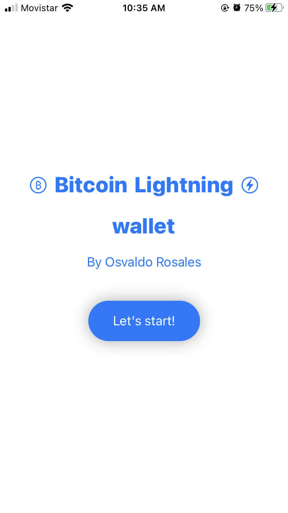
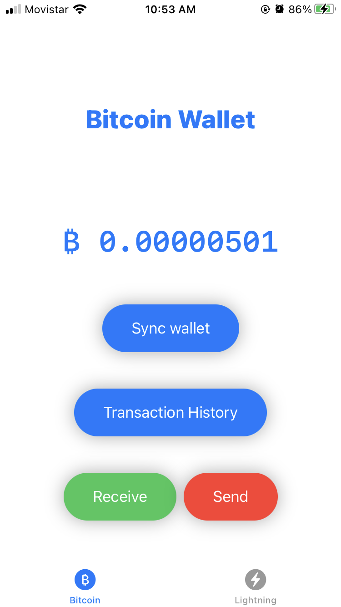
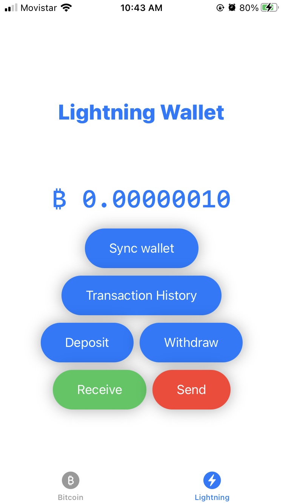
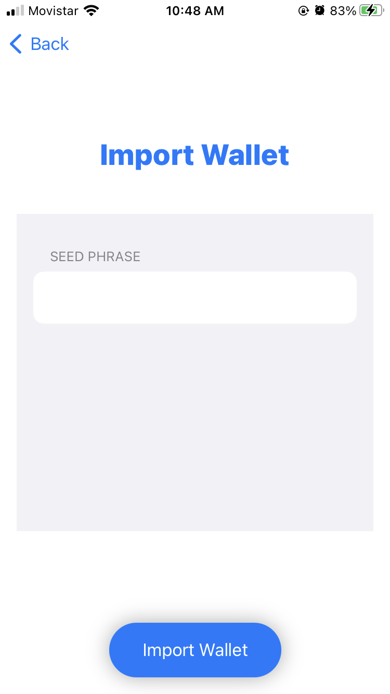
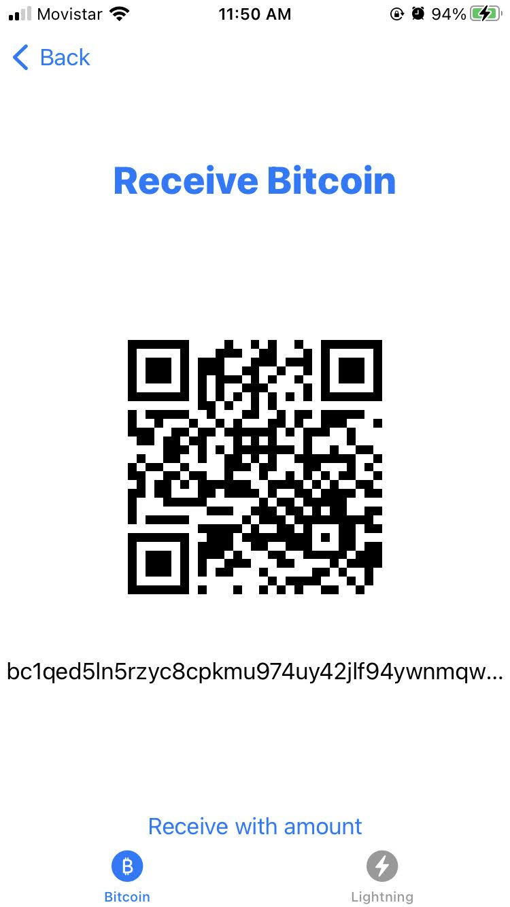
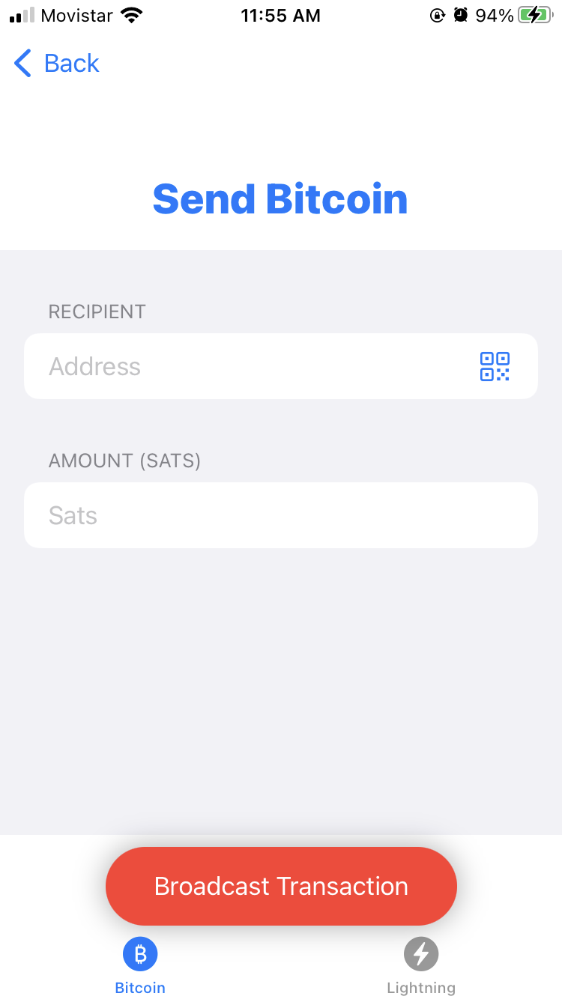
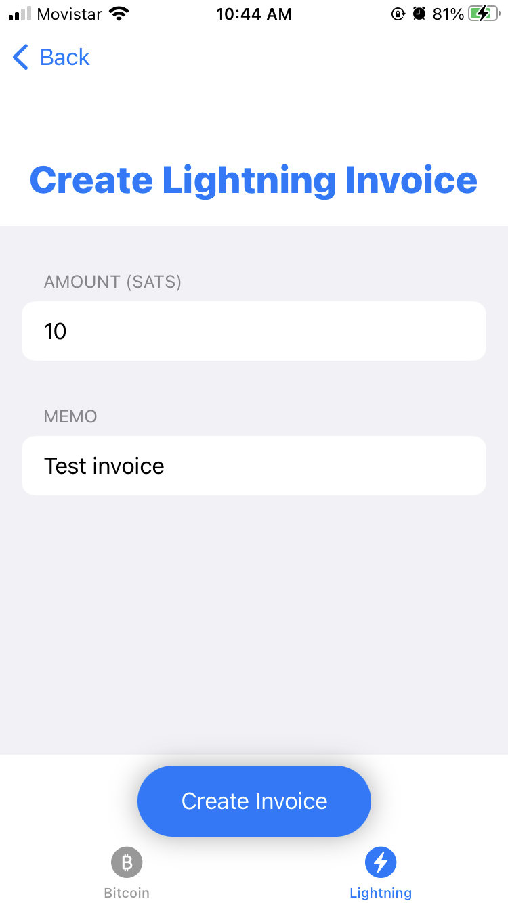
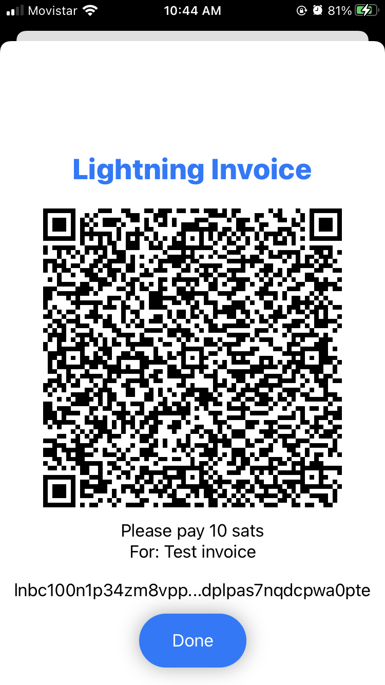

# BitcoinLightningIOSWallet

<table style="padding:10px">
  <tr>
    <td> <h2 align="center">Home</h2> </td>
    <td> <h2 align="center">Bitcoin Wallet</h2> </td>
    <td> <h2 align="center">Lightning Wallet</h2> </td>
    <td> <h2 align="center">Import Seed</h2> </td>
  </tr>
  <tr>
    <td>  </td>
    <td>  </td>
    <td>  </td>
    <td>  </td>
  </tr>
  
  
  <tr>
    <td> <h2 align="center">Receive BTC</h2> </td>
    <td> <h2 align="center">Send BTC</h2> </td>
    <td> <h2 align="center">Create Invoice</h2> </td>
    <td> <h2 align="center">invoice View</h2> </td>
  </tr>
  <tr>
    <td>  </td>
    <td>  </td>
    <td>  </td>
    <td>  </td>
  </tr>
</table>

This project is a prototype Bitcoin-Lightning IOS app built with  `bdk` (Bitcoin Dev Kit) Swift bindings and IBEXHub API. 

Features include
 - Create or import seedphrase for bitcoin wallet.
 - Create or import Lightning wallet (Provided by IBEXHub API).
 - Sync with Electrum Server for Blockchain data and transaction broadcast (Mainnet & Testnet).
 - Create Lightning invoice.
 - Pay Lightning invoice.
 - Transaction history.
 - Scan Bitcoin and Lightning invoice QR codes.

BitoinLightningIOSWallet was inspired by @thunderbiscuit's [Bitcoindevkit Android Demo Wallet](https://github.com/thunderbiscuit/bitcoindevkit-android-sample-app) and @futurepaul's [BdkSwiftSample](https://github.com/futurepaul/BdkSwiftSample), with the primary changes being a code restructure following the MVVM design pattern and Lightning payments integration.

## Requirements
- Electrum server
- IbexHub API account
- Dependencies: [bdk-swift 0.3.0](https://github.com/bitcoindevkit/bdk-swift) and [CodeScanner 1.1.0](https://github.com/twostraws/CodeScanner)

Check these out:
 - [bdk](https://github.com/bitcoindevkit/bdk)
 - [bdk-swift](https://github.com/bitcoindevkit/bdk-swift)
 - [IBEXHub API](https://ibexmercado.gitbook.io/ibex-hub-api/)
